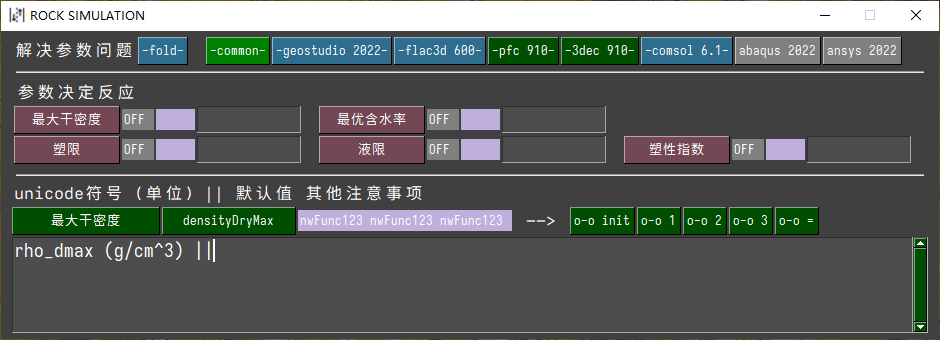
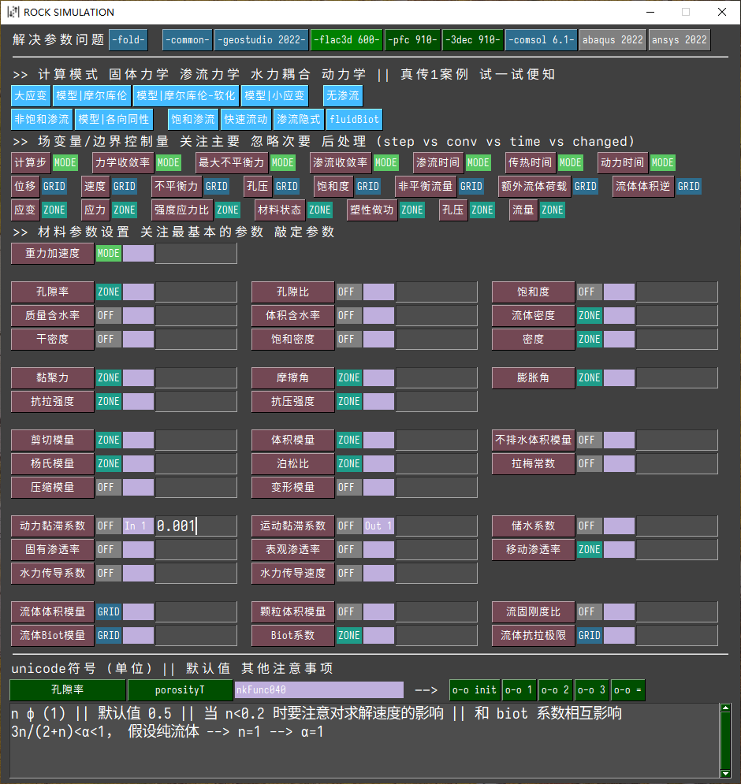

<!--  -->

# ggsimulationguide

解决计算模式和参数问题

### 功能

- 正在进行重构，拓展计算功能

#### GEOSTUDIO相关

#### FLAC3D相关

### 安装

从`release`下载压缩文件，解压到任意文件夹，双击 `ggsimulationguide.exe` 即可。

应用第一次启动后，“可能”会有一个弹窗提示需要`pysimplegui`的授权码。请您到`pysimplegui`的官网注册一个授权码，并复制粘贴到弹窗中，此后便可以正常使用了。

填写授权码的步骤，在一台机器上只需要一次，故您可能需要填写，也可能您已经在其他应用使用期间填写过从而不需要这一步。

### 赞助

本工具使用了 `pysimplegui` 进行开发，但是我没有购买`pysimplegui`的商业许可证，故您需要自己注册授权码。

如果您感觉本工具对您有帮助，可以考虑赞助 :smile:
